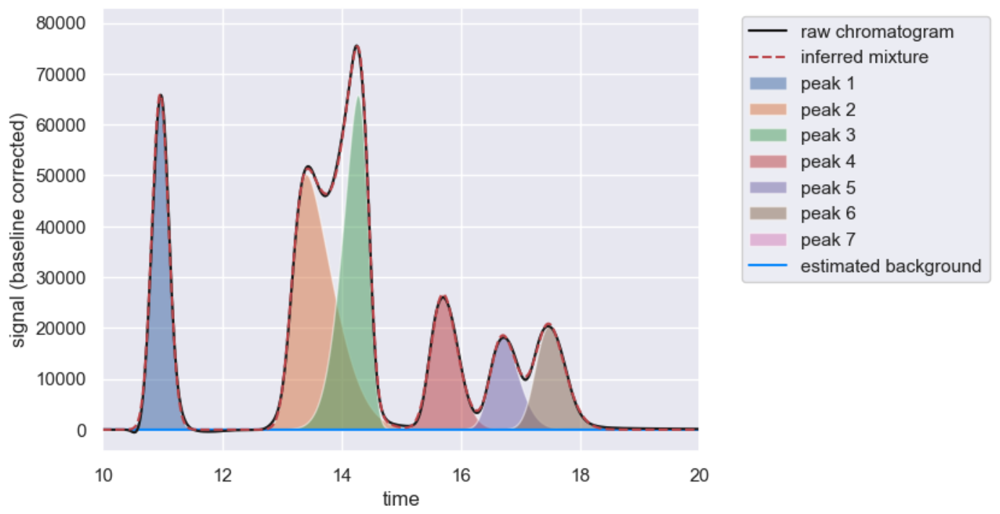

[](https://www.gnu.org/licenses/gpl-3.0)
[](https://github.com/cremerlab/hplc-py/actions/workflows/pytest.yaml)
[](https://codecov.io/gh/cremerlab/hplc-py)
[](https://badge.fury.io/py/hplc-py)
[](https://pypistats.org/packages/hplc-py)
[](https://doi.org/10.21105/joss.06270)

# About

**H**igh-**P**erformance **L**iquid **C**hromatography (HPLC) is an analytical
technique which allows for quantitative characterization of the chemical
components of a mixture. While many of the technical details of HPLC are now
automated, the programmatic cleaning and processing of the resulting data often requires extensive manual labor. This package was
developed to alleviate some of this burden, making the actual running of the
HPLC the most time-consuming part of the quantification. 

# Installation

You can install `hplc-py` on pip:

```
$ pip install --upgrade hplc-py
``` 

# Usage
`Hplc-py` has [extensive documentation available](https://cremerlab.github.io/hplc-py) with 
a [quickstart](https://cremerlab.github.io/hplc-py/tutorials/quickstart.html), [example calibration curve](https://cremerlab.github.io/hplc-py/tutorials/calibration_curve.html), 
[step-by-step description of the algorithm](https://cremerlab.github.io/hplc-py/methodology/problem.html), and [API documentation](https://cremerlab.github.io/hplc-py/quant.html).

The meat of `hplc-py` is 
in its `Chromatogram` class which performs all peak detection and fitting 
steps. There is an additional `load_chromatogram` function which makes it easy to 
read in chromatograms from a long-form tidy `.csv` file. 

## Loading and Viewing Chromatograms
For example, say you have a chromatogram file `example.csv` with columns of `time` and `signal`
that looks like this:

```
time,signal
0, 0
0.00833, 0
0.01667, -1
...
12.77500,668
12.78333,746
12.79167,830
12.80000,919
12.80833,1015
12.81667,1118
12.82500,1228
12.83333,1345
12.84167,1471
...
```

Using `hplc-py`, this can be read from the file and loaded as a `Chromatogram`
object as

```python
In[1]: from hplc.io import load_chromatogram
In[2]: from hplc.quant import Chromatogram
In[3]: example = load_chromatogram('example.csv', cols=['time', 'signal'])
In[4]: chrom = Chromatogram(example)
```

The chromatogram is now loaded as an `hplc-py` `Chromatogram` object, which has 
a variety of methods annotated in the [documentation](https://cremerlab.github.io/hplc-py/quant.html). 
The chromatogram can be viewed by calling the `show()` method

```python
In[5]: chrom.show()
Out[5]: [<Figure size 1280x960 with 1 Axes>, <Axes: xlabel='time', ylabel='signal'>]
```
yielding:


### Quantifying Peaks
Peaks can be automatically detected and fit in a chromatogram by calling the 
`fit_peaks` method of a `Chromatogram` object. Doing so on our example chromatogram 
yields a pandas DataFrame with the peaks and their properties

```python 
In[6]: peaks = chrom.fit_peaks()
Performing baseline correction: 100%|████████| 299/299 [00:01<00:00, 167.06it/s]
Deconvolving mixture: 100%|███████████████████████| 3/3 [00:13<00:00,  4.66s/it]

In[7]: peaks.head()
Out[7]:   
retention_time	   scale	    skew	   amplitude	        area	signal_maximum	peak_id
	 10.90	0.158768	0.691961	23380.386403	2.805646e+06	66064.361454	1
	 13.17	0.592828	3.889788	43048.461053	5.165815e+06	50331.167860	2
	 14.45	0.350139       -2.997977	34791.996875	4.175040e+06	65352.588796	3
	 15.53	0.308900	1.567356	14938.309504	1.792597e+06	26723.707626	4
	 16.55	0.272283	1.261303	9512.727882	1.141527e+06	18121.299375	5
```

The resulting chromatogram reconstruction can be seen by again calling the `show()` 
method, this time restricting the plotted time region between 10 and 20 minutes.

```python
In[8]: chrom.show([10, 20])
Out[8]:[<Figure size 640x480 with 1 Axes>,
 <Axes: xlabel='time', ylabel='signal (baseline corrected)'>]
```


# Citation
If you use `hplc-py` in your research please cite the version of the software
you use along with our [descriptive paper in JOSS](https://joss.theoj.org/papers/10.21105/joss.06270):

```
@article{chure2024,
	author = {Chure, Griffin and Cremer, Jonas},
	title = {hplc-py: A Python Utility For Rapid Quantification of Complex Chemical Chromatograms},
	volume = 9,
    number = 94,
	url = {https://joss.theoj.org/papers/10.21105/joss.06270},
	doi = {10.21105/joss.06270},
	number = {94},
	urldate = {2024-02-16},
	journal = {Journal of Open Source Software},
	year = {2024}
   }
```

# Contributing
Development of hplc-py occurs on various feature branches which are merged and released upon approval by Griffin Chure (@gchure), the primary maintainer of the software.

Please submit issues and bug reports using the issue tracker. When filing an
issue, provide a reproducible example that demonstrates the bug or problem.
Feature requests can also be made through the issue tracker, though it is up to
the discretion of the maintainers what is worth implementing.

For help with troubleshooting fitting of your chromatograms, please open an [issue](https://github.com/cremerlab/hplc-py/issues/new) giving an explanation of what's giving you trouble and  provide 
a minimal working example of the problem. You can also tag your issue with the `troubleshooting` flag. 

# License
This software is released under the GNU General Public License version 3 (GPLv3). The complete license is provided as `LICENSE.txt`, but a brief description is as follows:

```
hplc-py
Copyright (C) 2024, Griffin Chure & Jonas Cremer

This program is free software: you can redistribute it and/or modify
it under the terms of the GNU General Public License as published by
the Free Software Foundation, either version 3 of the License, or
(at your option) any later version.

This program is distributed in the hope that it will be useful,
but WITHOUT ANY WARRANTY; without even the implied warranty of
MERCHANTABILITY or FITNESS FOR A PARTICULAR PURPOSE.  See the
GNU General Public License for more details.

You should have received a copy of the GNU General Public License
along with this program.  If not, see <http://www.gnu.org/licenses/>.
```
