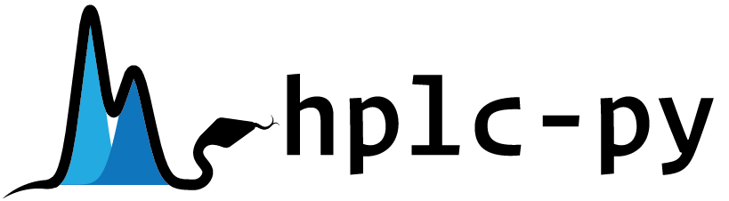

[](https://www.gnu.org/licenses/gpl-3.0)
[](https://github.com/cremerlab/hplc-py/actions/workflows/pytest.yaml)

# About

**H**igh-**P**erformance **L**iquid **C**hromatography (HPLC) is an analytical technique which allows for the quantitative characterization of the chemical components of a mixture. While many of the technical details of HPLC are now automated, the programmatic cleaning and processing of the resulting data can be cumbersome and often requires extensive manual labor. This package was developed to alleviate some of this burden, making the actual running of the HPLC the most time-consuming part of the analysis. 

# Installation
Hplc-py can be installed via pip

```
$ pip install --upgrade hplc-py
```


If you are interested in contributing to the development of the software, 
you can clone or fork the [GitHub Repository](https://github.com/cremerlab/hplc-py)
and install the package locally as follows:

```
$ git clone git@github.com:cremerlab/hplc-py
$ cd hplc-py
$ pip install -e ./
```

If you don't want to clone the source repository, you can install the development
version directly from GitHub:

```
$ pip install -e git+https://github.com/cremerlab/hplc-py.git
```

# License
The software is released under a standard MIT license which reads as follows:

```
MIT License

Copyright (c) 2021 The Authors

Permission is hereby granted, free of charge, to any person obtaining a copy
of this software and associated documentation files (the "Software"), to deal
in the Software without restriction, including without limitation the rights
to use, copy, modify, merge, publish, distribute, sublicense, and/or sell
copies of the Software, and to permit persons to whom the Software is
furnished to do so, subject to the following conditions:

The above copyright notice and this permission notice shall be included in all
copies or substantial portions of the Software.

THE SOFTWARE IS PROVIDED "AS IS", WITHOUT WARRANTY OF ANY KIND, EXPRESS OR
IMPLIED, INCLUDING BUT NOT LIMITED TO THE WARRANTIES OF MERCHANTABILITY,
FITNESS FOR A PARTICULAR PURPOSE AND NONINFRINGEMENT. IN NO EVENT SHALL THE
AUTHORS OR COPYRIGHT HOLDERS BE LIABLE FOR ANY CLAIM, DAMAGES OR OTHER
LIABILITY, WHETHER IN AN ACTION OF CONTRACT, TORT OR OTHERWISE, ARISING FROM,
OUT OF OR IN CONNECTION WITH THE SOFTWARE OR THE USE OR OTHER DEALINGS IN THE
SOFTWARE.

```


This repo is under construction and a more detailed README will show up shortly.
## License
This software is released under the GNU General Public License version 3 (GPLv3). The complete license is provided as `LICENSE.txt`, but a brief description is as follows:

```
hplc-py
Copyright (C) 2023, Griffin Chure & Jonas Cremer

This program is free software: you can redistribute it and/or modify
it under the terms of the GNU General Public License as published by
the Free Software Foundation, either version 3 of the License, or
(at your option) any later version.

This program is distributed in the hope that it will be useful,
but WITHOUT ANY WARRANTY; without even the implied warranty of
MERCHANTABILITY or FITNESS FOR A PARTICULAR PURPOSE.  See the
GNU General Public License for more details.

You should have received a copy of the GNU General Public License
along with this program.  If not, see <http://www.gnu.org/licenses/>.
```