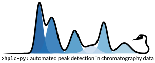

.. image:: https://img.shields.io/badge/License-GPLv3-blue.svg
   :target: https://www.gnu.org/licenses/gpl-3.0

.. image:: https://github.com/cremerlab/hplc-py/actions/workflows/pytest.yaml/badge.svg
   :target: https://github.com/cremerlab/hplc-py/actions/workflows/pytest.yaml

.. image:: https://codecov.io/gh/cremerlab/hplc-py/branch/main/graph/badge.svg?token=WXL50JVR6C
   :target: https://codecov.io/gh/cremerlab/hplc-py
 
.. image:: https://badge.fury.io/py/hplc-py.svg
   :target: https://pypi.org/project/hplc-py/#description 

.. image:: https://zenodo.org/badge/667610900.svg
   :target: https://zenodo.org/badge/latestdoi/667610900

----

About
=====

Welcome to the documentation for `hplc-py`! This package provides a limited, yet
robust, interface for accurate and efficient peak detection and quantification 
from chromatography data, specifically from High-Performance Liquid Chromatography (HPLC).

Chromatography is an analytical technique which allows for quantitative
characterization of a chemical mixture. While many of the technical details of
HPLC are now automated, the programmatic cleaning and processing of the
resulting data can be cumbersome and often requires extensive manual labor. The 
goal of `hplc-py` is to reduce this manual labor and make running of the 
chromatographic separation the most time-consuming step in the process.

Installation
------------
You can install `hplc-py` using pip::

   $ pip install --upgrade hplc-py

Dependencies for `hplc-py` are as follows:

- Python 3.9 or newer
- NumPy_ 
- SciPy_
- Pandas_
- Seaborn_
- Tqdm_
- Termcolor_

.. _NumPy: http://www.numpy.org/
.. _SciPy: http://www.scipy.org/
.. _Pandas: http://pandas.pydata.org/
.. _tqdm: https://tqdm.github.io/
.. _Matplotlib: https://matplotlib.org/
.. _Seaborn: https://seaborn.pydata.org/
.. _Termcolor: https://pypi.org/project/termcolor/

.. toctree::
   :maxdepth: 2
   :caption: User Guides
   :hidden:
   
   getting_started/quickstart.ipynb

.. toctree::
   :maxdepth: 1
   :caption: Examples
   :hidden:

.. toctree::
   :maxdepth: 1
   :caption: API Documentation
   :hidden: 

   quant
   io

.. toctree::
   :maxdepth: 1
   :caption: Credit & Citation
   :hidden:

   citation
   