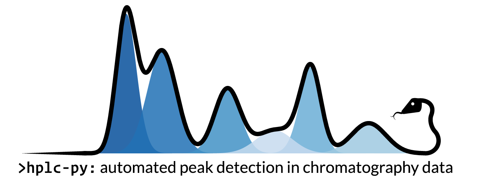

----

About
=====
Welcome to the documentation for `hplc-py`! This package provides a limited, yet
robust, interface for accurate and efficient peak detection and quantification 
from chromatography data, specifically from High-Performance Liquid Chromatography (HPLC).

Installation
------------
You can install `hplc-py` using pip::

   $ pip install --upgrade hplc-py

with the following dependencies

- Python 3.9 or newer
- NumPy_ 
- SciPy_
- Pandas_
- Seaborn_
- Tqdm_

.. _NumPy: http://www.numpy.org/
.. _SciPy: http://www.scipy.org/
.. _Pandas: http://pandas.pydata.org/
.. _tqdm: https://tqdm.github.io/
.. _Matplotlib: https://matplotlib.org/
.. _Seaborn: https://seaborn.pydata.org/

.. toctree::
   :maxdepth: 2
   :caption: Contents:

.. toctree::
   :maxdepth: 3
   :caption: User Guide

   getting_started/quickstart.ipynb
   getting_started/algorithm.ipynb

.. toctree::
   :maxdepth: 4
   :caption: API Documentation

   quant
   io

.. toctree::
   :maxdepth: 2
   :caption: Credit & Citation
   

.. Indices and tables
.. ==================

.. * :ref:`genindex`
.. * :ref:`modindex`
.. * :ref:`search`
